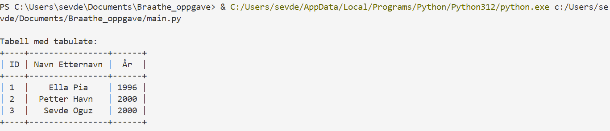
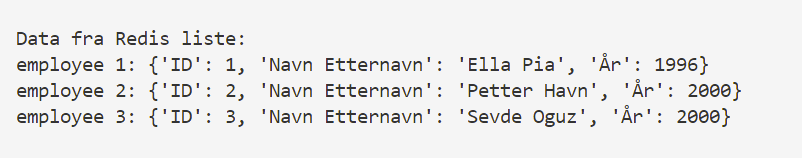
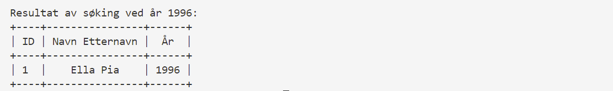

# Braathe oppgave
#### Oppgaven ligger i master branchen

I dette prosjektet lagde jeg en enkel tabell med litt data ved bruk av tabulate biblioteket.

Lastet ned Redis med brew og koblet til redis serveren.
Lagret og hentet data fra Redis ved for løkker.

For å bruke Algolia lagde jeg en algolia konto.
Koblet til Algolia ved å sette in API keys og brukte det til å søke etter år fra tabellen.
Slik ble resultatet ved foreksempel søk av år 1996:

